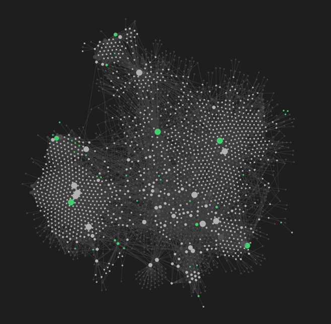

# Personal knowledge management for beginners

Whether you are a researcher, a student or a professional, having a system to manage the flood of information can transform how you work and learn. Here are some tips on how to develop your own **Personal Knowledge Management (PKM)**.


## What is personal knowledge management?

Personal knowledge management (PKM), also known as individual knowledge management, is a self-management concept aimed at organizing your own knowledge resources and learning processes independently and skillfully. The goal is to use this information effectively, whether it is for personal growth or professional tasks. Think of it as a personalized system that helps you stay on top of what you have read and learned.


Typically, PKM consists of:

- **Collection**: Gathering useful information from articles, books, conversations, or other media.

- **Organization**: Structuring this information in a way that makes sense to you—whether through apps, handwritten notes, or digital databases.

- **Reflection and Synthesis**: Connecting new information with what you already know and reflecting on how it applies to your life or work.

- **Applying**: Using your new found knowledge to generate ideas for your work projects or daily life.

```{r fig-pkm, echo=FALSE, out.width="100%", fig.cap="The cycle of PKM"}


```


## How can PKM help you become a better researcher?

With the endless flow of information on a daily basis, it is easy to feel completely overwhelmed. Without a clear strategy to manage this influx, it is challenging to retain and apply useful knowledge effectively. For researchers, the importance of managing knowledge cannot be overstated. Effective PKM can transform the way you handle research, from literature review to data analysis. Here is how:

1. **Efficient Literature Review**: In research, keeping track of key papers, theories and data is critical. A PKM system allows you to store all your references, annotate papers and create summaries, which can be easily retrieved when writing or planning new research projects.

2. **Connecting Ideas**: Research often involves bringing together disparate ideas from various sources. PKM helps you map out connections between theories, studies and ideas, fostering creativity and deeper insights. With everything organized in a central system, you can see links between concepts that might otherwise be overlooked.

3. **Staying Organized**: Managing research involves a lot of data, articles and notes. PKM ensures all this information is easily accessible and well-structured, so you can find what you need quickly. 
4. **Collaboration and Knowledge Sharing**: PKM does not just help you manage your own knowledge; it also makes collaboration easier. With clear organization, you can quickly share insights or resources with colleagues, contributing to a more collaborative research environment.

5. **Time Management**: Research can be time-consuming, but PKM can make it more efficient by reducing the time spent on administrative tasks like searching for references or managing data. This gives you more time to focus on analysis and critical thinking.


## Getting started with PKM

Implementing a PKM does not have to be complicated. Start small and choose tools that work best for you. Some popular methods include:

- **Note taking strategies**: It is also really important to think about the way you are taking notes! What information are you capturing? Do you have a way to link the notes? Do you differentiate between facts, quotes and emerging ideas? Have a look at the [**Zettelkasten**](https://www.goodnotes.com/blog/zettelkasten-method) method.

- **Digital Tools**: There are many apps like Notion, Evernote or Roam hat allow you to capture and organize information in one place, making it easy to track your notes, references and projects. My personal favorite is Obsidian (see below for an illustration).

  - **AI-Powered Tools**: With the rise of artificial intelligence, tools like ChatGPT and Notion AI can assist in summarizing articles, generating ideas or even organizing your notes more efficiently. AI can help automate the process of filtering important information, making knowledge management faster and more streamlined. This can free up time for deeper reflection and analysis, allowing you to focus on applying your knowledge rather than managing it.

- **Analog Systems**: If you prefer pen and paper, a bullet journal, a notebook or flashcards can be just as effective for organizing your thoughts and ideas.

- **Hybrid Approaches**: Combining digital and analog methods can also work, allowing you to capture ideas on the go and organize them later in a more structured format.


## How can it look like in practice?


One of the most difficult things for me was to admit to myself that my PKM **can never be perfect**. I started it after I already started working as a researcher and after completing my PhD. Basically, I placed my new, revised PKM on top of my existing way to do literature research and taking notes. In addition, there is simply too much information out there: I will never be able to capture all the information I would like to have.

Once I made my peace with that, I had to decide for the tools I would to make my PKM efficient. I have adopted a combination of tools and techniques that work well for my own needs as a researcher. It is definitely worth taking some time and really explore the options.

 - **Literature research**: For literature research, I rely on Zotero. The feature I value the most in Zotero is the ability to assign tags easily. Unlike a folder-based system where you have to decide where to file a document (and often find that it fits into multiple categories), Zotero’s tagging system allows me to categorize literature dynamically without forcing it into a rigid structure. In addition, I make use of several AI tools to help streamline my workflow. Tools like Research Rabbit and Consensus are particularly helpful when summarizing articles and exploring new research avenues. AI assistants save time by helping me quickly synthesize key insights from large volumes of text. 
 
 - **Note-taking**: When it comes to note-taking, I orient myself around the Zettelkasten method, which emphasizes creating atomic notes (small, self-contained ideas) that can easily be linked together. This approach helps me not only organize my thoughts but also create connections between different pieces of information, which is crucial for deep understanding and research.

- **Organization**: To manage these notes, I use [Obsidian](https://obsidian.md/). It’s a free and highly flexible tool that allows me to store all my documents locally, which I prefer over cloud-based options. Obsidian also offers numerous features for linking notes, which is something I use extensively in my workflow (see figure 2). The ability to create a web of interconnected ideas is, in my opinion, one of the most powerful aspects of knowledge management. There are also plenty of online resources and tutorials that help new users make the most of the tool.


In my opinion, the most important part of my PKM system remains the ability to link my notes in Obsidian, as this allows me to connect ideas and insights across different fields and projects, which is the foundation of my research process.


```{r fig-obsidian, echo=FALSE, out.width="100%", fig.cap="The graphical view of the linked notes in Obsidian"}



```


